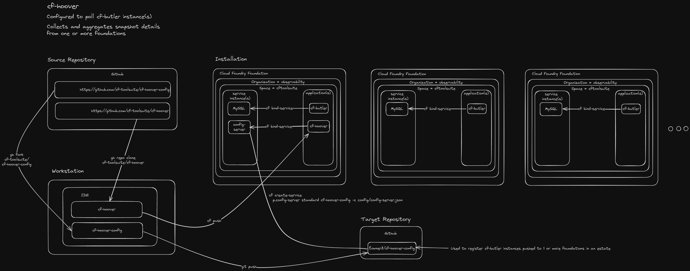

# VMware Tanzu Application Service > Hoover

## Background

You're already aware of and are using [cf-butler](https://github.com/cf-toolsuite/cf-butler) to help report on and manage application and service instances.  Wouldn't it be nice to easily aggregate reporting across multiple foundations? This is `cf-hoover`'s raison d'être.

